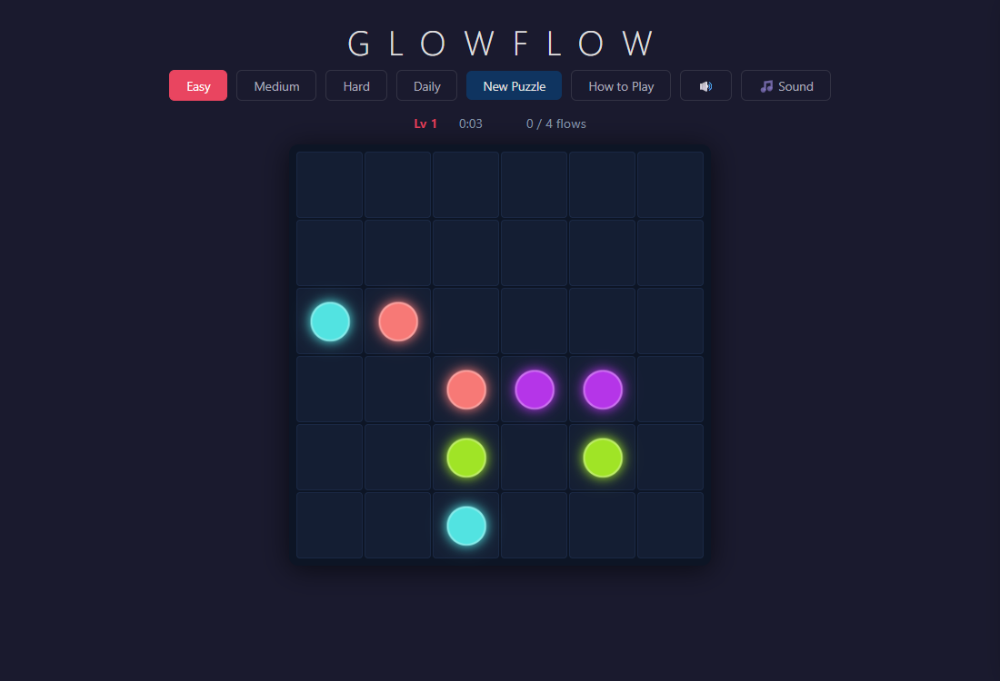
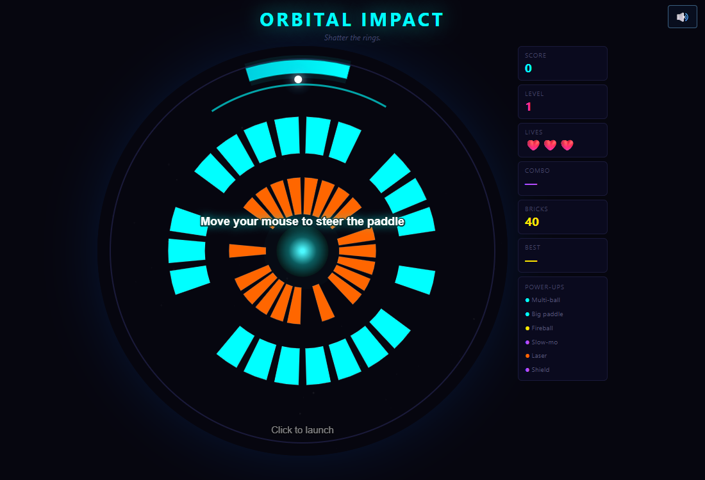
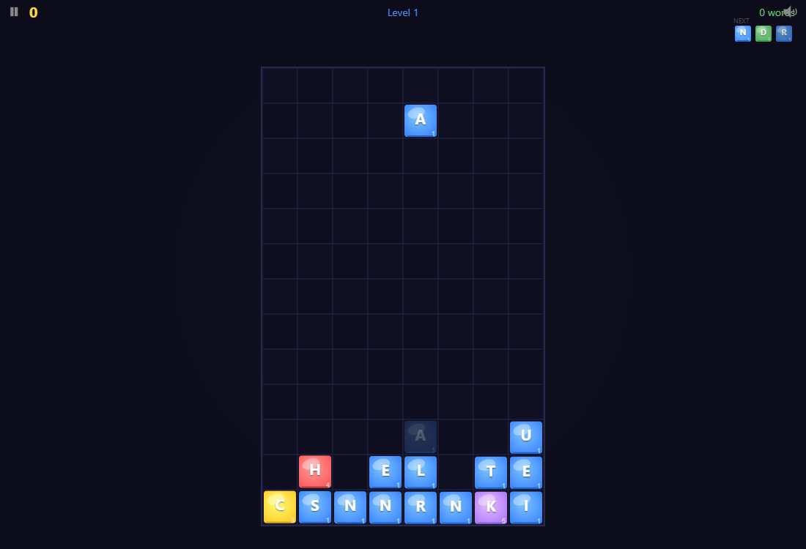
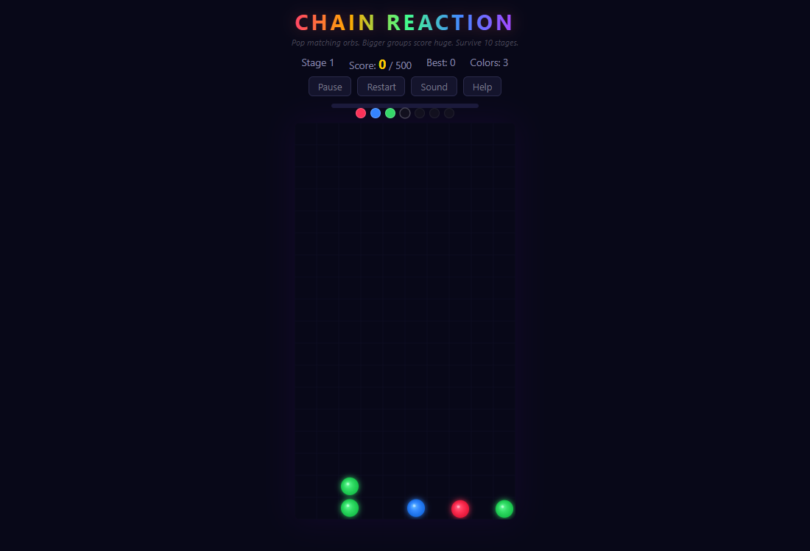

# Game Lab

Four small arcade games that run entirely in your browser. Each game is a single HTML file with zero dependencies: no build step, no framework, no server. Built through AI collaboration.

**[Insert coin: play them all here](https://caldwellcourtneyc.github.io/game-lab/)**

## The games

| | |
|---|---|
| **[Glowflow](https://caldwellcourtneyc.github.io/game-lab/glowflow.html)** <br> Connect matching dots to fill the board. Every move plays music, with four sound palettes to choose from. Zen by default; a challenge mode if you want stakes. |  |
| **[Orbital Impact](https://caldwellcourtneyc.github.io/game-lab/orbital-impact.html)** <br> Circular brick-breaker. Orbit the paddle around the rings, keep the ball alive, shatter everything. Power-ups and boss levels included. |  |
| **[Word Drops](https://caldwellcourtneyc.github.io/game-lab/word-drops.html)** <br> Word game meets Tetris. Letters fall, you steer them, line up 3+ to spell words and tap them to clear. Chains multiply your score. |  |
| **[Chain Reaction](https://caldwellcourtneyc.github.io/game-lab/chain-reaction.html)** <br> Pop connected same-colored orbs. Bigger groups score huge, single pops cost you. Survive 10 stages of new colors and faster drops. |  |

All four work on phones: touch is a first-class control scheme, not an afterthought.

## Run locally

Download any game's HTML file and double-click it. That's the whole install.

```
git clone https://github.com/caldwellcourtneyc/game-lab.git
```

Then open `index.html` (the launcher) or any game file directly in a browser.

## How they're built

Each game is self-contained HTML/CSS/JS on a canvas, with synthesized Web Audio (no sound files) and localStorage for high scores and settings. The repo is served as-is via GitHub Pages.

## License

[MIT](LICENSE)
